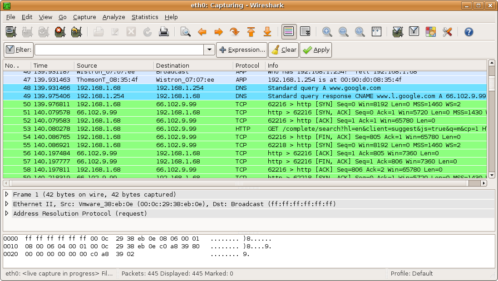

# Wireshark Installer

Author: The Wireshark Team

If you want Wireshark GUI version, you must install and open desktop environment first in this link: https://github.com/471D38UNNUX/Desktop-Environment-Installer

For termux installation:

Run this script in terminal not termux:

$apt install git

$git clone https://github.com/471D38UNNUX/Wireshark-Installer

$cd Wireshark-Installer

$bash Wireshark-Installer-For-Termux.sh

For start Wireshark.

$wireshark-gtk (GUI version)

$tshark -h (CLI version)

For linux installation:

For original version:

#sudo (apt/yum/zypper install/pacman -S) git

#git clone https://github.com/471D38UNNUX/Wireshark-Installer

#cd Wireshark-Installer

#cd Linux

#bash Wireshark-Installer-For-Linux-Based-On-(Debian/Red-Hat).sh

For start Wireshark.

#wireshark-gtk (GUI version)

#tshark -h (CLI version)

For WSL version:

If you want Wireshark GUI version, you must install and open desktop environment first in this link: https://github.com/471D38UNNUX/Desktop-Environment-Installer

#sudo (apt/zypper) install git

#git clone https://github.com/471D38UNNUX/Wireshark-Installer

#cd Wireshark-Installer

#cd Linux

#bash Wireshark-Installer-For-Linux-Based-On-Debian.sh

For start Wireshark.

#wireshark-gtk (GUI version)

#tshark -h (CLI version)

Enjoy.

Nb: I'm not owner this tool, but i just made installation for usage more easier.

For more information you can visit official website: https://www.wireshark.org/

